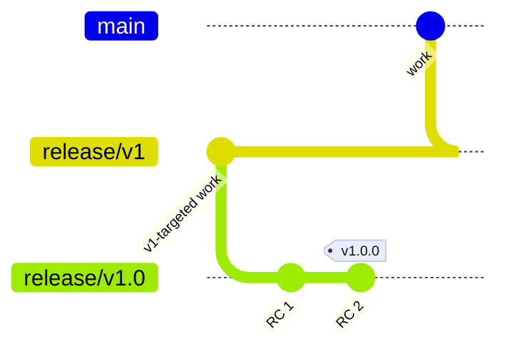

# Releasing

## Branches



- **`main`** — the working copy. All day-to-day development happens here. Always the
  latest and greatest, never itself released directly.
- **`release/vMAJOR`** (e.g. `release/v1`) — cut from `main` when starting work on a
  new major version. Only receives commits targeted at that major version, keeping it
  separate from whatever's moved on to next on `main`. The first one is `release/v1`
  — there is no `release/v0`.
- **`release/vMAJOR.MINOR`** (e.g. `release/v1.0`) — cut from its `release/vMAJOR`
  branch when it's time to stabilize a specific release. This is the *release
  candidate* branch: every push to it builds an RC archive via CI.

## CI

| Trigger | Workflow | Produces |
|---|---|---|
| Push or PR, any branch | [ci.yml](.github/workflows/ci.yml) | `swift test` + an unsigned `Copacel.app`, uploaded as a workflow artifact anyone can download (needs right-click → Open, no signature). |
| Push to `release/vX.Y` (not `release/vX` itself — no dot, doesn't match) | [release-archive.yml](.github/workflows/release-archive.yml) | An unsigned `Copacel.xcarchive` workflow artifact — a Release Candidate build, ready to be signed locally. |
| Push of a `vX.Y.Z` tag | [release-draft.yml](.github/workflows/release-draft.yml) | A **draft** GitHub Release titled from the tag, with notes pulled from `RELEASE_NOTES.md` at that commit. No binary attached. |

Signing never happens in CI — only on your own Mac, with the `Developer ID
Application` certificate in your keychain. See [Scripts/package-release.sh](Scripts/package-release.sh).

## RELEASE_NOTES.md

Every branch that can ship a release (`main`, each `release/vMAJOR`, each
`release/vMAJOR.MINOR`) carries its own root-level `RELEASE_NOTES.md`, containing the
notes for whatever's next on *that* branch. When you tag a release, whatever's in
`RELEASE_NOTES.md` at that commit becomes the GitHub Release body.

- On `main`, it accumulates notes for whatever ships next, in general.
- Cutting `release/v1` from `main` carries `main`'s current `RELEASE_NOTES.md` along
  as a starting point — trim it to just what's relevant to v1.
- Cutting `release/v1.0` from `release/v1` does the same — refine it into the actual
  notes for `v1.0.0` as the RC branch stabilizes.
- Right after tagging a release, reset the branch's `RELEASE_NOTES.md` back to an
  empty `## Unreleased` section so it's ready to accumulate notes for whatever ships
  next from that branch.

## Cutting a release, step by step

1. **Start a major version** (only when there isn't one yet for this line):
   ```bash
   git switch main
   git switch -c release/v1
   git push -u origin release/v1
   ```
2. **Start a release candidate**, once `release/v1` has what you want in `v1.0.0`:
   ```bash
   git switch release/v1
   git switch -c release/v1.0
   git push -u origin release/v1.0
   ```
   Every subsequent push here triggers `release-archive.yml`, producing a fresh RC
   archive as a workflow artifact.
3. **Stabilize** — push fixes to `release/v1.0` until an RC archive is the one you
   want to ship. Update `RELEASE_NOTES.md` on this branch as you go.
4. **Tag it**:
   ```bash
   git tag v1.0.0
   git push origin v1.0.0
   ```
   This triggers `release-draft.yml`, which opens a draft GitHub Release titled
   "Copacel v1.0.0" with notes from `RELEASE_NOTES.md`.
5. **Sign locally** — download the RC archive that corresponds to the tagged commit
   (from the matching `release-archive.yml` run), then:
   ```bash
   Scripts/package-release.sh path/to/Copacel.xcarchive
   ```
   This produces a signed, packaged `dist/Copacel-1.0.0.dmg`.
6. **Upload and publish** — attach the DMG to the draft release on GitHub, review the
   notes, and publish it manually. Nothing about publishing is automated.
7. **Reset notes** — clear `release/v1.0`'s `RELEASE_NOTES.md` back to an empty
   `## Unreleased` section for the next release candidate on this line.
